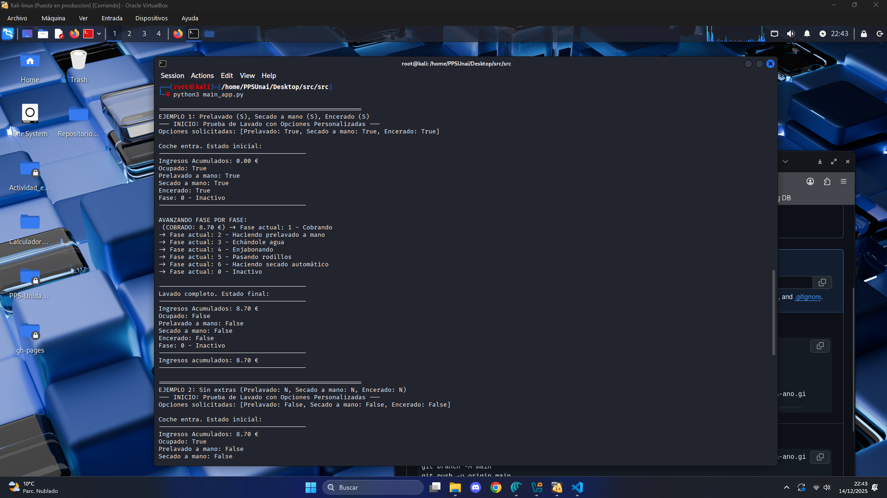
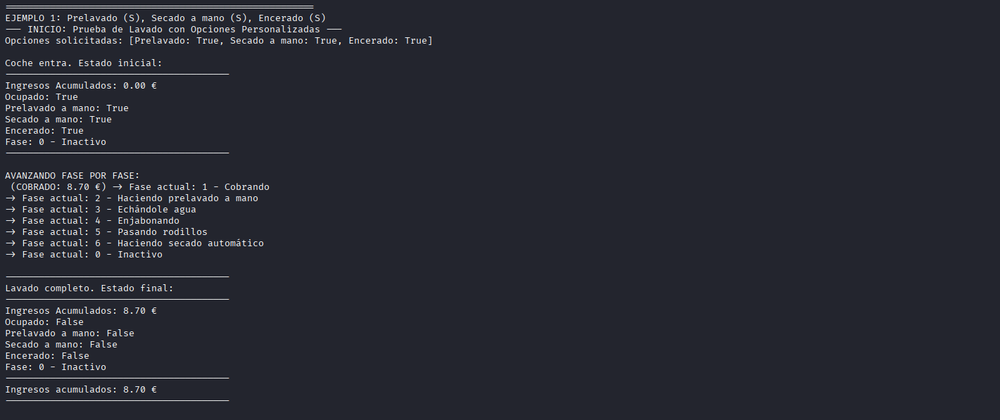
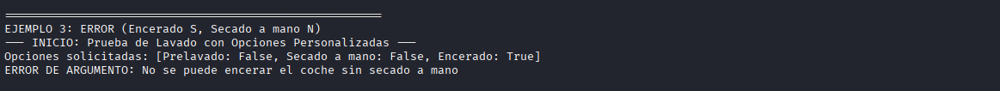

## Ejecución en Sandbox 

### Paso 1 : Empezaremos instalando la herramienta de SANDBOX (Firejail).

Usaremos el comandoo `apt update && apt install -y firejail firetools` en un terminal con privilegios de administrador.

### Paso 2 : Obtenemos nuestro programa a analizar (Lavadero.py)

Para ello, he descargado el programa del enlace de la actividad 1 de este RA y la he ubidado en el **escritorio de Kali**, dentro de la carpeta **src**

Compruebo que funciona a la perfección antes de realizar nada(Como es un programa orientado a objetos con múltiples dependencias, ejecutamos el main), yo como ya tengo Python3 instalad0o no tengo que instalar nada adicional.

### Paso 3 : Ejecutamos el programa bajo el entorno SANDBOX (Firejail)

La importancia de aislar empleempleando un entorno sandbox en vez de ejecutar nuestro programa directamente en el terminal del sistema es aislarlo para evitar que este pueda alterar o afectar al dispositivo, a parte de convertirlo en una prueba más controlada. En este caso es un prpgrama pequeño que no supone ningún riesgo pero si se estuviera desarrollando un programa que manipula información del equipo si.

Lo lanzaremos en el entorno aislado mediante el comando:
`firejail python3 /home/PPSUnai/Desktop/src/src/main_app.py  `

### Resultado final.

En este programa, se declaran 4 instancias de simulaciones, en las que se probará el objeto lavadero con distintos parámetros, propiciando casos particulares. Se ejecutan a la perfección:

**Prueba 1:**

**Prueba 2:**

**Prueba 3:**

**Prueba 4:**

