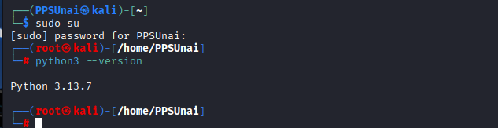
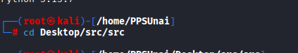
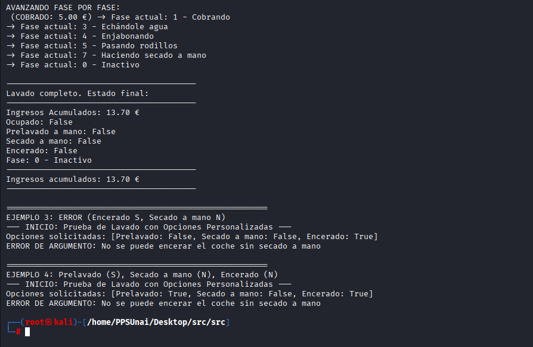

# Ejecución y depuración

Una vez visto el apartado en el que explicamos el funcionamiento del programa Lavadero, vamos a hacer una prueba de interpretación del lenguaje. 

Para ello nos dirigiremos hacia un terminal con privilegios de administrador. tenemos que cerciorarnos de teneir instalado Python 3 en nuestra máquina, porque si de lo contrario no podremos ejecutar el programa.

## Comprobar que tenemos Python instalado 

Para ver si lo tenemos en nuestra máquina ejecutamos:

    bash
    python3 --version

## Dirigirse a la carpeta donde se encuentra el fichero
Ejecutar un `.py` con **python3**
Ir a la carpeta donde está el script:

    bash
    cd /home/PPSUnai/Desktop/src/src/

## Ejecutar el fichero principal:

Es importante para este punto recordar que el inicio de la ejecución se produce en `Main`, por lo que ejecutaremos el fichero Main y no la clase `Lavadero`.

    bash
    python3 main_app.py

Se ejecuta sin problemas, este es un pequeño vistazo a la ejecución del código.

## Detección de error y solución

Como podemos observar, al final de la ejecución nos avisa sobre un error de interpretación emergente.

Si nos fijamos bien, nos indica el tipo de error que es y donde se encuentra, en erte caso se trata de un error por ausencia de un parámetro pedido al ejecutar la prueba 4, es más nos dice hasta el parámetro que es èncerado`. 

> Hay que fijarse bien en el tipo de variable antes de hacer nada. En este caso es un **Booleano** :TypeError: ejecutarSimulacion() missing 1 required positional argument 'encerado'

Para corregirlo, solamente nos dirigimos a la línea de código en la que salta y agregamos el parámetro al final.

Tras agregar:

    ejecutarSimulacion(lavadero_global, prelavado=True, secado_mano=False, **encerado=True**)

    
Volveremos al terminal y ejecutamos el comando `python3 main_app.py` de nuevo, esta vez, el no nos saltará ningún problema de interpretación, finalizando sin problemas la ejecución de las 4 pruebas programadas.

