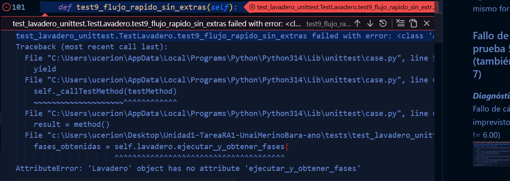
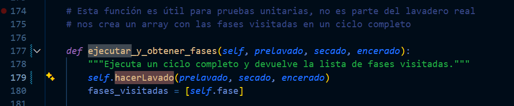
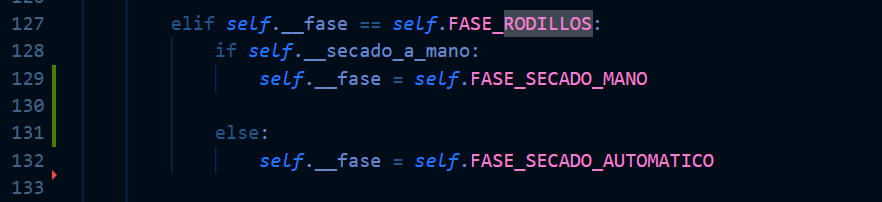
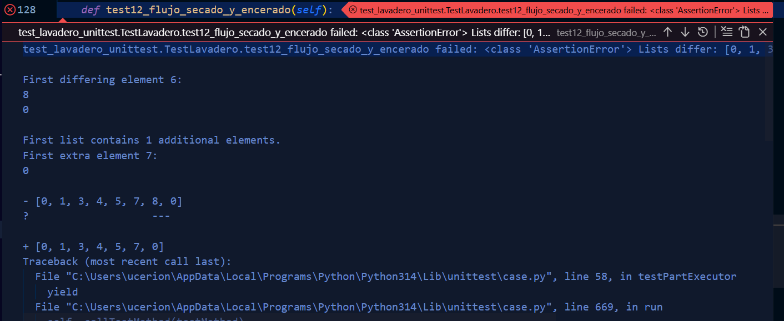

# Pruebas
 
 En este apartado vamos a realizar un análisis lógico del programa con base en una serie de pruebas partiendo de las siguientes premisas:

1. Cuando se crea un lavadero, éste no tiene ingresos, no está ocupado, está en fase 0 y todas las opciones de lavado (prelavado a mano, secado a mano y encerado) están puestas a false.

1. Cuando se intenta comprar un lavado con encerado pero sin secado a mano, se produce una ValueError.

1. Cuando se intenta hacer un lavado mientras que otro ya está en marcha, se produce una ValueError.

1. Si seleccionamos un lavado con prelavado a mano, los ingresos de lavadero son 6,50€.

1. Si seleccionamos un lavado con secado a mano, los ingresos son 6,00€.

1. Si seleccionamos un lavado con secado a mano y encerado, los ingresos son 7,20€.

1. Si seleccionamos un lavado con prelavado a mano y secado a mano, los ingresos son 7,50€.

1. Si seleccionamos un lavado con prelavado a mano, secado a mano y encerado, los ingresos son 8,70€.

1. Si seleccionamos un lavado sin extras y vamos avanzando fases, el lavadero pasa por las fases 0, 1, 3, 4, 5, 6, 0.

1. Si seleccionamos un lavado con prelavado a mano y vamos avanzando fases, el lavadero pasa por las fases 0, 1, 2, 3, 4, 5, 6, 0.

1. Si seleccionamos un lavado con secado a mano y vamos avanzando fases, el lavadero pasa por las fases 0, 1, 3, 4, 5, 7, 0.12.

1. Si seleccionamos un lavado con secado a mano y encerado y vamos avanzando fases, el lavadero pasa por las fases 0, 1, 3, 4, 5, 7, 8, 0.

1. Si seleccionamos un lavado con prelavado a mano y secado a mano y vamos avanzando fases, el lavadero pasa por las fases 0, 1, 2, 3, 4, 5, 7, 0.

1. Si seleccionamos un lavado con prelavado a mano, secado a mano y encerado y vamos avanzando fases, el lavadero pasa por las fases 0, 1, 2, 3, 4, 5, 7, 8, 0.

## Creación de los tests

Para ello completaremos nuestro archivo de tests siguiendo las **consignas** superiores. 

> Es importante declarar el tipo de test y vincular bien este fichero para que no tengamos problemas a la hora de correr los tests.

    import unittest
    from src.lavadero import Lavadero

    class TestLavadero(unittest.TestCase):

        def setUp(self):
            """Prepara una nueva instancia de Lavadero antes de cada prueba."""
            self.lavadero = Lavadero()

        # ----------------------------------------------------------------------
        # Test 4 del enunciado (reseteo)
        # ----------------------------------------------------------------------
        def test_reseteo_estado_con_terminar(self):
            """Test 4 extra: Verifica que terminar() resetea flags y fase pero mantiene ingresos."""
            # Iniciar un lavado cualquiera
            self.lavadero.hacerLavado(True, True, True)
            # Avanzar al menos una fase para que cobre
            self.lavadero.avanzarFase()
            self.assertTrue(self.lavadero.ingresos > 0)

            # Terminar manualmente
            self.lavadero.terminar()

            self.assertEqual(self.lavadero.fase, Lavadero.FASE_INACTIVO)
            self.assertFalse(self.lavadero.ocupado)
            self.assertFalse(self.lavadero.prelavado_a_mano)
            self.assertFalse(self.lavadero.secado_a_mano)
            self.assertFalse(self.lavadero.encerado)
            # Los ingresos se mantienen
            self.assertTrue(self.lavadero.ingresos > 0)

        # ----------------------------------------------------------------------
        # TESTS 1–3: reglas básicas / excepciones
        # ----------------------------------------------------------------------
        def test1_estado_inicial_correcto(self):
            """Test 1: estado inicial sin ingresos, fase 0, no ocupado y opciones a False."""
            self.assertEqual(self.lavadero.fase, Lavadero.FASE_INACTIVO)
            self.assertEqual(self.lavadero.ingresos, 0.0)
            self.assertFalse(self.lavadero.ocupado)
            self.assertFalse(self.lavadero.prelavado_a_mano)
            self.assertFalse(self.lavadero.secado_a_mano)
            self.assertFalse(self.lavadero.encerado)

        def test2_excepcion_encerado_sin_secado(self):
            """Test 2: encerar sin secado a mano lanza ValueError."""
            with self.assertRaises(ValueError):
                self.lavadero.hacerLavado(prelavado_a_mano=False,
                                        secado_a_mano=False,
                                        encerado=True)

        def test3_excepcion_lavado_mientras_ocupado(self):
            """Test 3: iniciar un segundo lavado mientras está ocupado lanza RuntimeError."""
            self.lavadero.hacerLavado(False, False, False)
            # Sin terminar el primero, intentamos iniciar otro
            with self.assertRaises(RuntimeError):
                self.lavadero.hacerLavado(True, False, False)

        # ----------------------------------------------------------------------
        # TESTS 4–8: ingresos según combinación de opciones
        # (usamos una nueva instancia por test gracias a setUp)
        # ----------------------------------------------------------------------
        def _cobrar_lavado(self, prelavado, secado, encerado):
            """Helper: inicia un lavado con opciones y avanza una fase para que cobre."""
            self.lavadero.hacerLavado(prelavado, secado, encerado)
            ingresos_antes = self.lavadero.ingresos
            self.lavadero.avanzarFase()  # 0 -> 1 y llama a _cobrar()
            ingresos_despues = self.lavadero.ingresos
            return round(ingresos_despues - ingresos_antes, 2)

        def test4_ingresos_prelavado(self):
            """Test 4 consigna: con prelavado a mano los ingresos son 6.50€."""
            coste = self._cobrar_lavado(prelavado=True, secado=False, encerado=False)
            self.assertEqual(coste, 6.50)

        def test5_ingresos_secado_mano(self):
            """Test 5: con secado a mano los ingresos son 6.00€."""
            coste = self._cobrar_lavado(prelavado=False, secado=True, encerado=False)
            self.assertEqual(coste, 6.00)

        def test6_ingresos_secado_y_encerado(self):
            """Test 6: con secado a mano y encerado los ingresos son 7.20€."""
            coste = self._cobrar_lavado(prelavado=False, secado=True, encerado=True)
            self.assertEqual(coste, 7.20)

        def test7_ingresos_prelavado_y_secado(self):
            """Test 7: con prelavado y secado a mano los ingresos son 7.50€."""
            coste = self._cobrar_lavado(prelavado=True, secado=True, encerado=False)
            self.assertEqual(coste, 7.50)

        def test8_ingresos_completo_con_todo(self):
            """Test 8: con prelavado, secado a mano y encerado los ingresos son 8.70€."""
            coste = self._cobrar_lavado(prelavado=True, secado=True, encerado=True)
            self.assertEqual(coste, 8.70)

        # ----------------------------------------------------------------------
        # TESTS 9–14: flujo de fases usando ejecutar_y_obtener_fases
        # ----------------------------------------------------------------------
        def test9_flujo_rapido_sin_extras(self):
            """Test 9: fases 0,1,3,4,5,6,0 sin extras."""
            fases_esperadas = [0, 1, 3, 4, 5, 6, 0]
            fases_obtenidas = self.lavadero.ejecutar_y_obtener_fases(
                prelavado=False, secado=False, encerado=False
            )
            self.assertEqual(
                fases_esperadas, fases_obtenidas,
                f"Secuencia de fases incorrecta.\nEsperadas: {fases_esperadas}\nObtenidas: {fases_obtenidas}"
            )

        def test10_flujo_con_prelavado(self):
            """Test 10: con prelavado fases 0,1,2,3,4,5,6,0."""
            fases_esperadas = [0, 1, 2, 3, 4, 5, 6, 0]
            fases_obtenidas = self.lavadero.ejecutar_y_obtener_fases(
                prelavado=True, secado=False, encerado=False
            )
            self.assertEqual(fases_esperadas, fases_obtenidas)

        def test11_flujo_con_secado_mano(self):
            """Test 11: con secado a mano fases 0,1,3,4,5,7,0."""
            fases_esperadas = [0, 1, 3, 4, 5, 7, 0]
            fases_obtenidas = self.lavadero.ejecutar_y_obtener_fases(
                prelavado=False, secado=True, encerado=False
            )
            self.assertEqual(fases_esperadas, fases_obtenidas)

        def test12_flujo_secado_y_encerado(self):
            """Test 12: con secado a mano y encerado fases 0,1,3,4,5,7,8,0."""
            fases_esperadas = [0, 1, 3, 4, 5, 7, 8, 0]
            fases_obtenidas = self.lavadero.ejecutar_y_obtener_fases(
                prelavado=False, secado=True, encerado=True
            )
            self.assertEqual(fases_esperadas, fases_obtenidas)

        def test13_flujo_prelavado_y_secado(self):
            """Test 13: con prelavado y secado fases 0,1,2,3,4,5,7,0."""
            fases_esperadas = [0, 1, 2, 3, 4, 5, 7, 0]
            fases_obtenidas = self.lavadero.ejecutar_y_obtener_fases(
                prelavado=True, secado=True, encerado=False
            )
            self.assertEqual(fases_esperadas, fases_obtenidas)

        def test14_flujo_completo_con_todo(self):
            """Test 14: con prelavado, secado y encerado fases 0,1,2,3,4,5,7,8,0."""
            fases_esperadas = [0, 1, 2, 3, 4, 5, 7, 8, 0]
            fases_obtenidas = self.lavadero.ejecutar_y_obtener_fases(
                prelavado=True, secado=True, encerado=True
            )
            self.assertEqual(fases_esperadas, fases_obtenidas)

    if __name__ == '__main__':
        unittest.main()

    
## Ejecutamos los tests.

Antes de nada, es necesario instalar un intérprete de Python, para ello descargaremos una versión estable en nuestra máquina y activaremos la opción de `Path`.

Después de añadir el intérprete, emplearemos el paquete de plugins oficial de **python** para VS-Code centrando nuestra atención en el icono del matraz.

> Pasos de configuración **Icono Matraz** -> tipo de test (unittest) ->  directorio de pruebas (tests) -> terminación (test_*.py)

Se nos generará una carpeta `.vscode` donde se guardará la configuración de búsqueda de pruebas y otro directorio `_pycashe_` dentro de `tests` donde se gurdarán las pruebas. Tras ello, **nos aparecerán las pruebas en el listado del apartado pruebas**.

Al darle al **Play** se nos ejecutarán todas las pruebas, mostrando en pantalla el resultado de estas, en nuestro caso vemos que han fallado las consignas, 5, 7, 9, 10, 11, 12, 13 y 14.

Revisaremos cada una de ellas para sanear los resultados.

## Ajustes de código.

Abordaremos cada caso por separado y siguiendo el mismo formato.

### Fallo de prueba 5 (la solución arregla la 7)

***Diagnóstico:*** Fallo de cálculo imprevisto. (6.20 != 6.00)

***SOLUCIÓN:***

Según las intenciones del comentario de deste método de cobro, el precio de secado a mano y encerado está invertido, lo que causa este problema de cálculo en la combinació de la prueba 5 y 7.

### Fallo de prueba 9 (la solución arregla la 10 ,11 y 13)

***Diagnóstico:*** Método inexistente.

***SOLUCIÓN:***

El método estaba fuera de la clase,la solución es tabular el método para incluirlo en la clase y un error ortográfico en un parámetro. 

> _hacer_lavado(...) -> hacerLavado(...)

Tras corregir este error, nos topamos con otro contiguo...

***Diagnóstico:*** Obtención de secuencias de fase dispareja.

***SOLUCIÓN:***

En el método de avanzar fase, debemos de intercambiar los valores de intercambio de fase en el if-else al acabar la fase de ***rodillos(5)***, en el caso de que secado a mano sea true, la fase siguiente ha de ser ***secado a mano(6)***, si no ***secado automático(7)***.

### Fallo de prueba 12 (la solución arregla la 14)

***Diagnóstico:*** Lista obtenida no coincidente con al esperada. (Falta la fase 8)

***SOLUCIÓN:***

El if que detecta si la fase es secado a ***mano(7)*** hace que finalice las fases, en su lugar, debe de cambiar la fase a la de ***encerado(8)***.

> Cambiar el contenido del if de: self.terminar() -> self.__fase = self.FASE_ENCERADO.