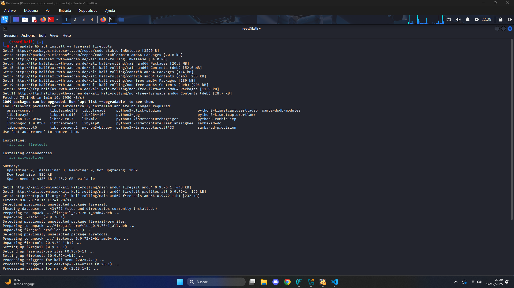
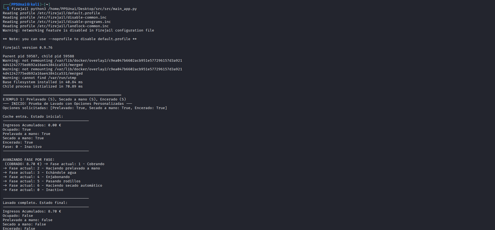
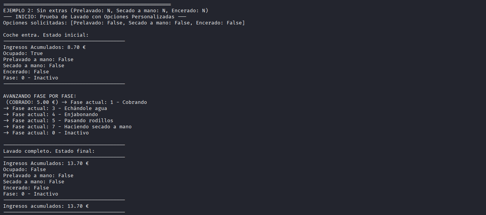
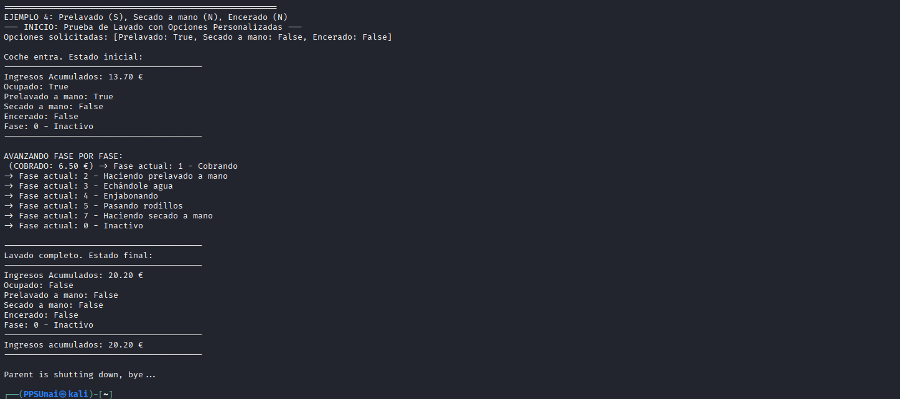

# Actividad obligatoria Unidad 1 - Tarea RA1

Autor: `Unai Merino Barañano`

## Elementos de Python

## Ejecución y Depuración

## Pruebas

## Ejecución en Sandbox 

### Paso 1 : Empezaremos instalando la herramienta de SANDBOX (Firejail).

Usaremos el comandoo `apt update && apt install -y firejail firetools` en un terminal con privilegios de administrador.

### Paso 2 : Obtenemos nuestro programa a analizar (Lavadero.py)

Para ello, he descargado el programa del enlace de la actividad 1 de este RA y la he ubidado en el **escritorio de Kali**, dentro de la carpeta **src**

Compruebo que funciona a la perfección antes de realizar nada(Como es un programa orientado a objetos con múltiples dependencias, ejecutamos el main), yo como ya tengo Python3 instalad0o no tengo que instalar nada adicional.

### Paso 3 : Ejecutamos el programa bajo el entorno SANDBOX (Firejail)

La importancia de aislar empleempleando un entorno sandbox en vez de ejecutar nuestro programa directamente en el terminal del sistema es aislarlo para evitar que este pueda alterar o afectar al dispositivo, a parte de convertirlo en una prueba más controlada. En este caso es un prpgrama pequeño que no supone ningún riesgo pero si se estuviera desarrollando un programa que manipula información del equipo si.

Lo lanzaremos en el entorno aislado mediante el comando:
`firejail python3 /home/PPSUnai/Desktop/src/src/main_app.py  `

### Resultado final.

En este programa, se declaran 4 instancias de simulaciones, en las que se probará el objeto lavadero con distintos parámetros, propiciando casos particulares. Se ejecutan a la perfección:

**Prueba 1:**

**Prueba 2:**

**Prueba 3:**

**Prueba 4:**

## Comparación estructural de los lenguajes más famosos.

En este apartado compararé algunos de los **lenguajes** de programación **más populares** y con distintos usos. Poniendo en valor la **seguridad** que ofrecen mediante un breve resumen.

|Lenguaje	|Tipo de Ejecución|	Paradigma Principal	|Seguridad de Memoria ​|
|---|---|---|---|
|Java	|Compilado  ​	|Orientado a Objetos ​	|Alta gracias a sandbox y garbage collector que aíslan código y evitan fugas de memoria.|
|Python	|Interpretado ​	|Multiparadigma ​	|Media con tipado dinámico permite inyecciones si no se valida input correctamente.|
|Rust	|Compilado  ​	|Multiparadigma (sistemas) ​	|Muy alta por ownership y borrow checker que previene race conditions y accesos inválidos.|
|C++	|Compilado  ​	|Multiparadigma  ​	|Baja por su gestión manual propensa a buffer overflows y errores de punteros.
|PHP	|Interpretado ​	|Multiparadigma (web, procedural) ​	|Media-baja, es vulnerable a SQL injection sin sanitización adecuada de entradas.
|JavaScript	|Interpretado (JIT en navegadores) ​	|Multiparadigma​	|Media,gracias a que el sandbox del navegador mitiga, pero el XSS es común por manipulación DOM insegura.
|C	|Compilado nativo ​	|Procedural/imperativo ​	|Muy baja, los punteros y memoria manual causan exploits frecuentes como overflows.

### Conclusiones

* Considero que de base los lenguajes compilados son más seguros que los interpretados, debido a que cuando debes de compilar el código, dicho proceso de traducción obliga al usuario a implementar el código correctamente antes de su ejecución, lo que asegura que la estructura del código es óptima.

* Los 2 lenguajes más seguros de la tabla son Java y Rust, sus estructuras son las más sólidas, asegurando que cualquier error sea controlable, por otra parte C y C++ requieren disciplina extrema debido a su bajo nivel. 

* Rust es el más sólido y seguro de todos al ser compilado y ser de bajo nivel, no obstante tiene abstracciones seguras que lo acercan a características de alto nivel, lo que lo hace más fácil de trabajar y familiar que el resto de lenguajes de su categoría.